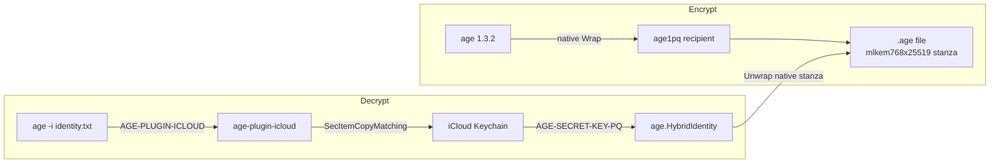

# age-plugin-icloud design

## Why not tagged recipients

Tagged types in [age v1.1.0](https://c2sp.org/age@v1.1.0) (`p256tag` / `mlkem768p256tag`, HRPs `age1tag` / `age1tagpq`) exist for **hardware** keys: P-256 (optionally hybridized with ML-KEM-768) plus a 4-byte tag so the plugin can skip a user-presence prompt. They are **not** MLKEM768-X25519.

This plugin stores a **software** seed that syncs via iCloud. Secure Enclave keys cannot sync. Native X-Wing is the right primitive:

- Recipients are stock `age1pq1...` — any age 1.3.2 client encrypts with no plugin
- Stanzas are stock `mlkem768x25519` — files are indistinguishable from `age-keygen -pq`
- Crypto is `age.GenerateHybridIdentity` / `ParseHybridIdentity` / `HybridRecipient` — no custom KEM
- The plugin only exists so the **secret stays in iCloud Keychain**, not on disk, and is never exported

The recipient is a normal age public key. The identity file is only a pointer so age will invoke this plugin.

## How a “generic” key still needs a plugin identity

Age only launches a plugin when it sees `AGE-PLUGIN-NAME-` or `age1name`. If the identity file contained `AGE-SECRET-KEY-PQ-1...`, age would decrypt **natively** and never touch Keychain.

So the on-disk identity is a **pointer**, not the key ([plugin spec](https://c2sp.org/age-plugin)):

```
# created: 2026-09-04T12:37:00+02:00
# recipient: age1pq1...
AGE-PLUGIN-ICLOUD-1...   # Bech32 payload = key name, e.g. "default"
```

That string is not secret. It can live in git/dotfiles. There is **no export path** to `AGE-SECRET-KEY-PQ-`; the seed is managed only in Keychain.



Default identity (`age -d -j icloud` / `age -e -j icloud`) is an empty plugin identity: decrypt tries every stored key; encrypt wraps to the `default` key.

## User flows

**Generate (once, any Mac signed into the Apple ID):**

```bash
age-plugin-icloud --generate              # name=default, annotate 5m
age-plugin-icloud --generate --name work --access-control=everyTime
age-plugin-icloud --generate --access-control=none
```

Prints the identity file (pointer + commented `age1pq` recipient and access-control) to stdout. Secret is written to Keychain with iCloud sync. Generate does not prompt.

**Encrypt — no plugin and no Touch ID** (recipient is native public key):

```bash
age -r age1pq1... -o secret.age file
```

**Encrypt from identity / `-j icloud`:** uses the public key stored in item attributes (no secret read, so no Touch ID):

```bash
age -e -i icloud-identity.txt -o secret.age file
age -e -j icloud -o secret.age file
```

**Decrypt on any Mac with that Apple ID** (plugin + Keychain; `EvaluatePolicy` if annotated `5m` or `everyTime`):

```bash
age -d -i icloud-identity.txt secret.age
age -d -j icloud secret.age
```

**List / delete** (list reprints identity files from attributes; no secret, no Touch ID):

```bash
age-plugin-icloud --list
age-plugin-icloud --list --name work
age-plugin-icloud --delete --name work
```

No `--export` / `--import`. Losing all Apple devices with iCloud Keychain is losing the key; that is the managed-key tradeoff (same class of risk as a YubiKey without a backup recipient). Users who want a paper backup should also encrypt to a separate age identity, not extract this one.

## Keychain layout

Use a **generic password** in the **data-protection keychain**, iCloud-synced. Crypto identities / Secure Enclave keys will not sync.

| Attribute | Value |
|---|---|
| Service | `li.lds.age-plugin-icloud` |
| Account | key name (`default`, `work`, …) |
| Label | `age-plugin-icloud (name)` |
| Value | UTF-8 `AGE-SECRET-KEY-PQ-1...` (age’s own encoding; `ParseHybridIdentity` on read) |
| Generic | JSON `{"recipient":"age1pq1...","accessControl":"none"|"everyTime"|"5m"}` so `--list` / encrypt-as-recipient never read the secret. `accessControl` is an annotation for an app-level prompt, not `kSecAttrAccessControl`. `presenceAt` is last prompt time per hardware UUID for the `5m` policy. |
| Synchronizable | true |
| Accessible | `kSecAttrAccessibleAfterFirstUnlock` |
| AccessControl | **not set.** `SecItemAdd` of `kSecAttrSynchronizable` + `kSecAttrAccessControl` returns `errSecParam` (`-50`) (tried `WhenUnlocked` and `AfterFirstUnlock`). |
| UseDataProtectionKeychain | true (also implied by Synchronizable) |

Queries **must** set `Synchronizable=true` or they will not see iCloud items. Do not set both `kSecAttrAccessible` and `kSecAttrAccessControl` on the same add. Do not use `kSecAttrAccess` (legacy ACL; incompatible with sync). Do not use `ThisDeviceOnly` accessibility (cannot sync).

### Sync vs Touch ID

Spike: **Keychain cannot attach `userPresence` to a synchronizable item** (`errSecParam`). Do not use `ThisDeviceOnly` to get a real ACL; that cannot sync.

Instead, store `--access-control` in `kSecAttrGeneric` at generate (no prompt): `none`, `everyTime`, or `5m`. On decrypt, `everyTime` always calls `LAContext.EvaluatePolicy`; `5m` skips for five minutes on this Mac after a successful prompt (`presenceAt[hardwareUUID]=unix time`). `userPresence` in existing items is treated as `5m`. That is plugin policy, not Keychain enforcement.

Encrypt / `--list` read attributes only and must not prompt.

Decrypt over SSH with `everyTime`/`5m` will need a GUI (or use `--access-control=none`).

## Code signing — yes, required

The data-protection keychain (which iCloud Keychain uses) authorizes access via **keychain-access-groups in the code signature**. This is not optional polish:

- Unsigned / ad-hoc-without-entitlements binaries often get `errSecMissingEntitlement` (`-34018`) on `kSecUseDataProtectionKeychain` / `kSecAttrSynchronizable`.
- The access group is part of the synced item. **Every Mac must run a binary signed with the same Team ID** or the other devices cannot read the item after sync.
- Ad-hoc `codesign -s -` can unlock local DP-keychain in some setups but has **no Team ID**, so it is the wrong distribution model.

Plan:

- Identifier: `li.lds.age-plugin-icloud` (`codesign -i`)
- Entitlements: `com.apple.application-identifier` = `TEAMID.li.lds.age-plugin-icloud`, `keychain-access-groups` = `TEAMID.li.lds.age-plugin-icloud`
- Local/dev: Apple Development cert from that team
- Release: Developer ID Application + notarization (Gatekeeper)
- Always set `kSecAttrAccessGroup` explicitly to that group on add/query so it does not drift with the binary’s default

Notarization is for users downloading a binary; a self-built signed tool on your own Macs only needs a stable Development/Developer ID identity.

## Plugin implementation (maximize age code)

Binary: `age-plugin-icloud` (plugin name `icloud`).

Use `filippo.io/age/plugin` v1.3.2:

- `plugin.New("icloud")` + `RegisterFlags` for generate/list/delete
- `HandleIdentity`: decode name from payload (empty = all keys) → Keychain secret lookup once → `age.ParseHybridIdentity` → cache for the process
- `HandleIdentityAsRecipient`: **attributes only** (stored `age1pq`) → `age.ParseHybridRecipient`
- **Do not** `HandleRecipient` — there is no `age1icloud` recipient; encryption to `age1pq` is native

No custom stanzas, HPKE, or bech32 of key material beyond what age already does.

Suggested layout:

- [`cmd/age-plugin-icloud/main.go`](cmd/age-plugin-icloud/main.go) — flags + `plugin.Main`
- `internal/identity` — name encoding, Keychain CRUD, wrap `HybridIdentity`

`go.mod`: `filippo.io/age v1.3.2`, `lds.li/keychain` with a `replace` to `../keychain` until that module is published.

macOS-only for Keychain operations (`//go:build darwin`); other OS: clear error that iCloud Keychain is unavailable.

## Keychain module additions

[`lds.li/keychain`](https://github.com/lstoll/keychain) `generic_password.go` / `security.go` needed (and now have):

- `kSecAttrSynchronizable` / `kSecAttrSynchronizableAny`
- `kSecAttrAccessible` (`WhenUnlocked`, `AfterFirstUnlock`)
- `kSecUseDataProtectionKeychain`
- `kSecAttrAccessGroup`
- `kSecAttrAccessControl` via `SecAccessControlCreateWithFlags` (`userPresence`)
- `kSecUseAuthenticationContext` / `kSecUseOperationPrompt`
- `LAContext` + `touchIDAuthenticationAllowableReuseDuration` through LocalAuthentication (objc via purego; this module already avoids cgo)
- Fields on `GenericPassword` / `GenericPasswordQuery` (pass on create **and** query)
- Tests behind the existing `TEST_KEYCHAIN=1` gate

## Requirements

**Functional**

- Generate named MLKEM768-X25519 identities into iCloud Keychain
- Identity file is a non-secret plugin pointer; recipient is native `age1pq`
- Decrypt `mlkem768x25519` stanzas via Keychain-backed `HybridIdentity`
- Encrypt without the plugin given the `age1pq` recipient
- Encrypt with `-i` / `-j icloud` via identity-as-recipient without reading the secret
- Empty identity (`-j icloud`): decrypt all names; encrypt `default`
- List names + recipients without printing or unlocking secrets
- Delete a named item (affects all devices; Apple’s sync semantics)

**Crypto / format**

- age 1.3.2 + spec v1.1.0 native X-Wing only
- `postquantum` label from `HybridRecipient` (do not mix with classical recipients)
- Store age’s Bech32 secret encoding, not a custom blob
- No export/import of `AGE-SECRET-KEY-PQ-`

**Platform**

- macOS (darwin/arm64 and amd64); iCloud Keychain enabled; same Apple ID
- Plugin on `PATH` as `age-plugin-icloud`
- Binary signed with a stable Team ID + keychain-access-groups (see above)

**Security**

- Secret never written to the identity file and never printed by the plugin
- Sync uses Apple’s iCloud Keychain E2E; items are not `ThisDeviceOnly`
- `5m` / `everyTime` are item annotations + `LAContext.EvaluatePolicy` on decrypt, not `kSecAttrAccessControl` (Apple rejects that on sync)

**Non-goals (v1)**

- `--export` / `--import` of native age secret keys
- Tagged `p256tag` / `mlkem768p256tag`
- Secure Enclave–held keys (`age-plugin-se`; cannot sync)
- Cross-process decrypted-key daemon / long timeout
- Custom `age1icloud` recipients or stanza types
- Linux/Windows secret storage
- Mixing X25519/scrypt with these recipients

## Implementation order

1. Keychain: synchronizable + accessible + data-protection + access group + access control + LAContext
2. Spike: `SecItemAdd` of synchronizable + `userPresence` — **rejected** (`errSecParam`); annotate in Generic instead; prompt on decrypt later
3. Plugin keygen/list/delete against Keychain
4. `HandleIdentity` / `HandleIdentityAsRecipient` wired to age hybrid types; cache secret per process
5. Signing/entitlements so DP-keychain and iCloud access group are stable
6. README (end-user) + DISTRIBUTION.md (local/dev, Developer ID, CI)
